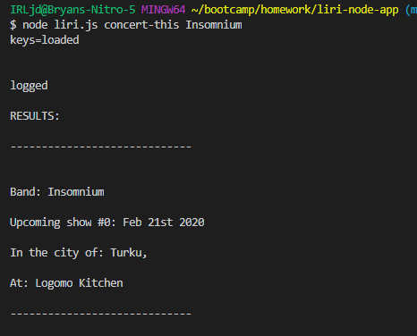
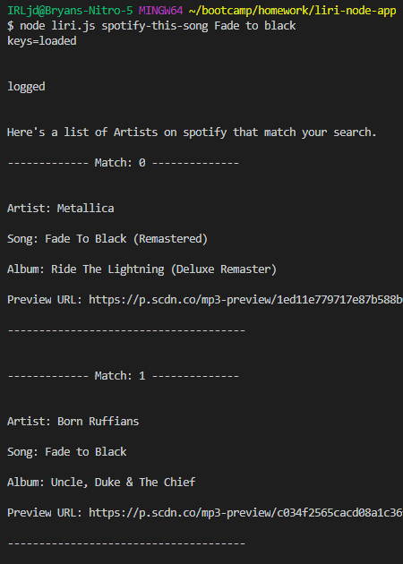
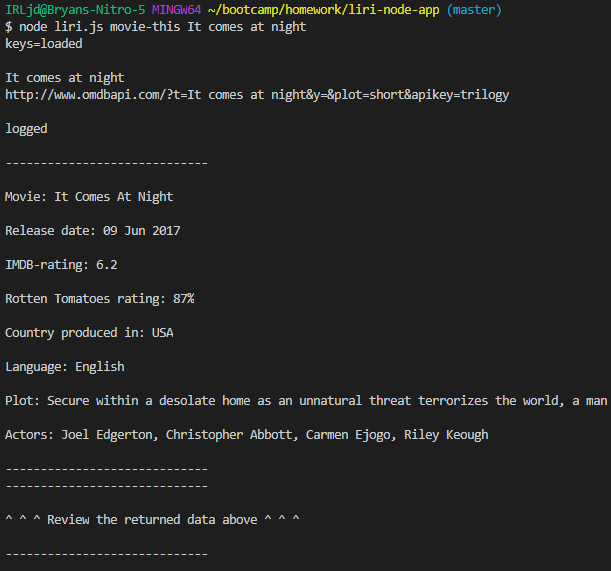
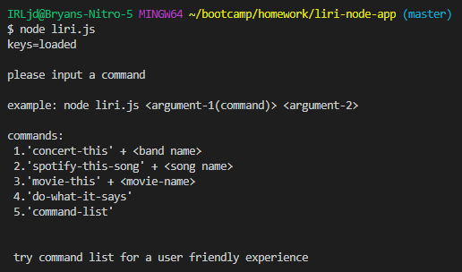
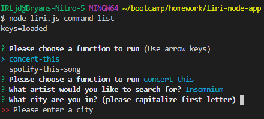
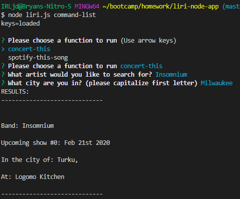
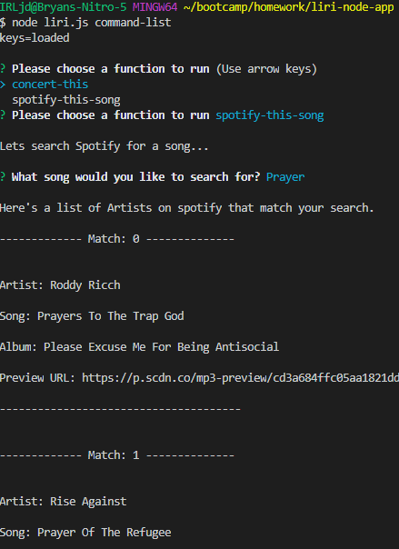
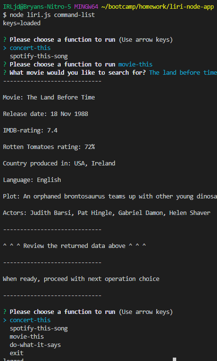
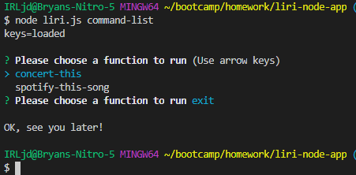

# Liri-node-app
LIRI is a command line node app.

LIRI will search Spotify for songs, Bands in Town for concerts, and OMDB for movies.
## What you will need ##

-explanations to follow

1. A code editor, I prefer Visual Studio Code ("https://code.visualstudio.com/").
2. Node.js to run node commands in terminal ("https://nodejs.org/en/download/").
3. '.gitignore' file to write what files you would not like to upload.
4. '.env' file, to store private API keys (spotify_ID & spotify_secret).
5. 'keys.js' file to export 'spotify' object with id and secret keys.
6. NPM packages 'inquirer', 'axios', 'node-spotify-api', 'moment', 'DotEnv', & 'fs'.
7. 'OMDB API' ("http://www.omdbapi.com") & 'Bands in Town API' ("http://www.artists.bandsintown.com/bandsintown-api").
8. 'package.json' file.
9. 'random.txt' and 'log.txt' files.
10. Spotify developer account (to obtain client ID and secret). Visit ("https://developer.spotify.com/my-applications/#!/").

##  Lets get started ##

1. Create a project folder (to save time you can clone this repository and skip the steps you don't need.)
-Create files named:
"liri.js"
"keys.js"
".env"
"random.txt"
"log.txt"
".gitignore"

2. In the root of your project folder in terminal and run "npm init -y". This will initialize a "package.json" file for your project. (this is required to install npm packages).

3. Inside your '.gitignore' file add the following lines. (this will prevent git from uploading these files).
-'node_modules'
-'.DS_Store'
-'.env'

4. Inside "keys.js".
-Add the following:

```
console.log("this is loaded");

exports.spotify = {
  id: process.env.SPOTIFY_ID,
  secret: process.env.SPOTIFY_SECRET
};

```
5. Inside ".env".
-Add the following:

```
# Spotify API keys

SPOTIFY_ID=your-spotify-id
SPOTIFY_SECRET=your-spotify-secret

```
-Replace the values with your API keys from ("https://developer.spotify.com/my-applications/#!/").

6. Inside "random.txt".
-Add the following:

spotify-this-song,"I Want it That Way"

7. Inside terminal once again Install all  relevant NPM packages via the following command:

npm i inquirer
npm i moment
npm i node-spotify-api
npm i axios

8. Inside "liri.js" add to the top of your page.
-Add the following:

require("dotenv").config();
let moment = require("moment");
var Spotify = require('node-spotify-api');
let axios = require("axios");
var keys = require("./keys.js");
const inquirer = require("inquirer");
var fs = require("fs");

9. When creating your spotify function add the following variable to access your API keys.

var spotify = new Spotify(keys.spotify);

10. Make it so when running 'node liri.js' in terminal, you can add the following as arguments for process.argv[2].

'concert-this'

'spotify-this-song'

'movie-this'

'do-what-it-says'

## What each command should do ##

### concert-this ###

-'contact-this' objective is to search for a band/artist via "Bands in Town API", and return the data via console.log.

- Example of command in terminal: 

`$ node liri.js concert-this <band/artist>`




### spotify-this-song ###

-'spotify-this-song' objective is to search for a song from "node-spotify-api", and return the data via console.log.

- Example of command in terminal:

`$ node liri.js spotify-this-song <song-name>`




### movie-this ###

-'movie-this' objective is to search for a movie from "OMDB API", and return the data via console.log.

- Example of command in terminal:

`$ node liri.js movie-this <movie-name>`




### do-what-it-says ###

-'do-what-it-says' objective is to run a function called 'doThisCommand()'
-'doThisCommand()' grabs the text from "random.txt",splits it via split(", "), assign's it to a variable(array) and then assigns array[0] to process.argv[2], and array[1] to process.argv.splice(3).join(" ").
-then array[0] and array[1] are passed as arguments inside run() function call.
-the run() function then runs the 'spotify-this-song' case in the switch statement and passes array[1] as an argument to the 'spotifyThisCommand()'. Using array[1] as its search term for the 'node-spotify-api'

- Example of command in terminal:

`node liri.js do-what-it-says`


### How the commands are defined ###

-First arguments must be assigned.
    ```
    let commandInput = process.argv[2];
    let searchInput = process.argv.slice(3).join(" ");
    ```

-Then we must make use of those commands.

```
    function run(commandInput, searchInput) {
    
    switch (commandInput) {
        case 'concert-this':
            concertThisCommand(searchInput);
            break;
        case 'spotify-this-song':
            spotifyThisCommand(searchInput);
            break;
        case 'movie-this':
            movieThisCommand(searchInput);
            break;
        case 'do-what-it-says':
            doThisCommand();
            break;
        case 'command-list':
            start();
            break;
        default:
            // Argument options displayed every time 'liri.js' is run w/o commands
            console.log("please input a command\n");
            console.log("example: node liri.js <argument-1(command)> <argument-2>\n");
            console.log("commands:\n 1.'concert-this' + <band name>\n 2.'spotify-this-song' + <song name>\n 3.'movie-this' + <movie-name>\n 4.'do-what-it-says'\n 5.'command-list'\n");
            console.log("\n try command list for a user friendly experience");
    }
};

```

-The commandInput becomes the case statement, and the searchInput becomes the argument passed to the functions requiring a search term.

-If no arguments are passed the default case will run, console logging a user friendly guide to utilizing liri-bot.

- Example of no arguments in terminal:



### Making use of a log ###

-'log.txt' will become an input/output command log by utilizing npm 'fs' package.

-The user arguments will be assigned to 2 add. variables. Then combined to a new variable.

```
let argOne = process.argv[2];
let argTwo = process.argv.slice(3).join(" ");
let input = "\n" + argOne + ", " + argTwo;

```

-Then variable 'fs' which was defined with the value of require('fs'). and used with the file system 'appendFile' function to output the "input" variable.

- Example of var fs:
```
var fs = require("fs");

```
- Example of appendFile() in action:
```
fs.appendFile('log.txt', "\n-INPUT-\n" + input, (err) => {
    if (err) throw err;
    console.log('\nlogged\n');
  });
```
-Inside the response of each '.then()' promise, the response data is placed into an array that can be logged for display AND utilized by appendFile() to log the output data to 'log.txt'

- Example of response data array and how its used with appendFile().
```
let movieData = [
                    "-----------------------------",
                    "Movie: " + response.data.Title,
                    "Release date: " + response.data.Released,
                    "IMDB-rating: " + response.data.imdbRating,
                    response.data.Ratings[1].Source + " rating: " + response.data.Ratings[1].Value,
                    "Country produced in: " + response.data.Country,
                    "Language: " + response.data.Language,
                    "Plot: " + response.data.Plot,
                    "Actors: " + response.data.Actors,
                    "-----------------------------"
                ].join("\n\n")
    
                console.log(movieData);
    
                fs.appendFile('log.txt', "\n\n-OUTPUT- \n" + movieData, (err) => {
                    if (err) throw err;
                    console.log('\nlogged\n');
                }); 
```

### How the API's work ###

#### Band in Town ####

-Bands in Town api, makes use of the npm 'axios' package. Using the searchInput (from the switch statement) that is assigned to a variable that is used inside the API URL:

- Example of Bands in Town with 'axios':
```
function concertThisCommand(searchInput) {

    let artistInput;

    if (!searchInput) {
        artistInput = "Insomnium"
        // Default artist search
    } else {
        artistInput = searchInput;
    };  
    

    axios.get("https://rest.bandsintown.com/artists/" + artistInput + "/events?app_id=codingbootcamp").then(function(response) {
       
        console.log("RESULTS: \n");

        for(let i = 0; i < response.data.length; i++){

            bandName = response.data[0].artist.name;
            showDate = moment(response.data[i].datetime).format("MMM Do YYYY");
            venueName = response.data[i].venue.name;
            city = response.data[i].venue.city;
            region = response.data[i].venue.region
                
            let bandData = [
                "-----------------------------\n",
                "Band: " + bandName,
                "Upcoming show " + "#" + [i] + ": " + showDate,
                "In the city of: " + city + ", " + region,
                "At: " + venueName,
                "-----------------------------\n"
            ].join("\n\n")

            console.log(bandData);

                fs.appendFile('log.txt', "\n\n-OUTPUT- \n" + bandData, (err) => {
                    if (err) throw err;
                        
                });    
            
        }; // END OF "for loop".

        console.log("-----------------------------");
        console.log("\n" + "^ ^ ^ Review the returned data above ^ ^ ^" + "\n");
        console.log("-----------------------------");


    });

}; // END OF 'concertThisCommand' FUNCTION
```

#### Node-spotify-api ####

-The npm package is assigned a variable with require.

- Example of node-spotify-api assigned to a variable with require:
```
var Spotify = require('node-spotify-api');
```

-The 'node-spotify-api package makes use of the API keys from .env file, that are accessed via process.env inside the 'spotify' object the keys.js file.

-In the 'keys.js' file , the 'spotify' object is exported.

-Inside the liri.js we retrieve the 'spotify' object and assign it to a new variable.

- Example of spotify object from 'keys.js' being assinged to a variable inside liri.js:
```
var spotify = new Spotify(keys.spotify);
```

-The 'spotify' variable is then used with the package 'search()' method to search the database for a track(type) and 'songInput'(query). The 'songInput' variable gets its value from 'searchInput'.

- Example of spotify.search:
```
function spotifyThisCommand(searchInput) {
    
    let songInput;
    if (!searchInput) {
        songInput = "The Sign"
        // Default spotify search
    } else {
        songInput = searchInput;
    };  
    var spotify = new Spotify(keys.spotify);

        // Node-spotify-api search.
        spotify.search(
            {
                 type: 'track', 
                 query: songInput 
            }
        ).then(function(response) {
           
                console.log("\nHere's a list of Artists on spotify that match your search. \n");

                for(let i = 0; i < response.tracks.items.length; i++) {
                    
                    let songData = [
                        "------------- Match: "+[i]+" --------------\n",
                        "Artist: " + response.tracks.items[i].artists[0].name,
                        "Song: " + response.tracks.items[i].name,
                        "Album: " + response.tracks.items[i].album.name,
                        "Preview URL: " + response.tracks.items[i].preview_url,
                        "--------------------------------------\n\n"
                    ].join("\n\n")

                    console.log(songData);

                    fs.appendFile('log.txt', "\n\n-OUTPUT- \n" + songData, (err) => {
                        if (err) throw err;
                        
                    });    

                };

                console.log("-----------------------------");
                console.log("\n" + "^ ^ ^ Review the returned data above ^ ^ ^" + "\n");
                console.log("-----------------------------");
           
        })
        .catch(function(err) {
            console.log(err);
        }); // END OF "then" & "catch" Spotify.search PROMISE.

}; // END OF 'spotifyThisCommand' FUNCTION
```

#### OMDB ####

-The OMDB API also uses axios to search the API by assigning the variable 'movieInput' and assigning it the value of 'searchInput'.

-The movieInput is then placed into the 'queryURL' variable that places it in the correct position inside the URL to utilize it as a search parameter for the API.

-A default output is used if movieInput has no value from the user forgetting to add a 2nd argument.

- Example of OMDB API:
```
 function movieThisCommand(searchInput) {
    let queryURL;
    let movieInput = searchInput;

    // If searchInput is undefined, pull 'Mr. Nobody' OMDB data
    if (!searchInput) {
         queryURL = "http://www.omdbapi.com/?t=Mr.+Nobody&y=&plot=short&apikey=trilogy"
    } else {
        queryURL = "http://www.omdbapi.com/?t=" + movieInput + "&y=&plot=short&apikey=trilogy"
        console.log(movieInput);
    };

        console.log(queryURL)
        axios.get(queryURL).then(function(response) {

            let movieData = [
                "-----------------------------",
                "Movie: " + response.data.Title,
                "Release date: " + response.data.Released,
                "IMDB-rating: " + response.data.imdbRating,
                response.data.Ratings[1].Source + " rating: " + response.data.Ratings[1].Value,
                "Country produced in: " + response.data.Country,
                "Language: " + response.data.Language,
                "Plot: " + response.data.Plot,
                "Actors: " + response.data.Actors,
                "-----------------------------"
            ].join("\n\n")

            console.log(movieData);

            fs.appendFile('log.txt', "\n\n-OUTPUT- \n" + movieData, (err) => {
                if (err) throw err;
                console.log('\nlogged\n');
            }); 
            
            console.log("-----------------------------");
            console.log("\n" + "^ ^ ^ Review the returned data above ^ ^ ^" + "\n");
            console.log("-----------------------------");

        }).catch(function(error) {
            if (error.response) {
                console.log("error #1: " + error.response);
            } else if (error.request) {
                console.log("error #2: " + error.request);
            } else if (error.message) {
                console.log("error #3: " + error.message);
            };

        }); // END OF "then" & "catch" Axios PROMISE.
    
}  // END OF 'movieThisCommand' FUNCTION 
```

### For fun try npm inquirer ###

-The 'inquirer' npm package can be used to prompt the user through liri bot by only entering one argument (command-list):

- Example of command-list:

`node liri.js command-list`

- Example of command in terminal:


#### Examples of command-list running w/ inquirer ####

-The 'concert-this' selection will prompt the user for a Band name, and current location.

-If a concert is coming to the current location a match will be found and logged among the other upcoming concerts.

-Inside the inquirer prompt, user validation is used to prevent the function from running without search terms.

- Example of concert-this:





#### Example of spotify-this-song running w/ inquirer ####

-The 'spotify-this-song' selection will prompt the user for a song to search for and return the data.

- Example of spotify-this-song:



#### Example of movie-this running w/ inquirer ####

-The 'movie-this' selection will prompt the user for a movie to search for and return the data.

-Each function inside the inquirer command list has recursion. Meaning once that function is done running, the start() function is called and the inquirer command-list prompt opend again.

-To exit the inquirer command-list prompt, simply select 'exit'.

- Example of movie-this:



- Example of exit:



#### How is inquirer used? ####

-First 'inquirer' is assigned to the variable 'inquirer' with the require method.

- Example of require:
```
const inquirer = require("inquirer");
```

-The variable 'inquirer' then uses the prompt() method to prompt the user.

- Examples of prompt():
```
    inquirer.prompt([
        {
            type:"list",
            name:"operation",
            message:"Please choose a function to run",
            choices: ["concert-this", "spotify-this-song", "movie-this", "do-what-it-says", "exit"]
        }
```

-The '.then()' promised is used to pass a function(response) and decide what to do with the data.

-The choice can be accessed with dot notation by assigning the value of response."name-string-value" (name key) to a variable.

- Example of resposne.name:
```
let variableName = response.operation
```

-To utilize the command list and determine what function to call, the response.operation is used in a conditional if statement to compare the value to a string matching the choice.

-Each choice is assigned a different function.

- Example of using inquirer to run a command-list choice:
```
function start() {
    // Inquirer NPM - Prompt questions to user.
    inquirer.prompt([
        {
            type:"list",
            name:"operation",
            message:"Please choose a function to run",
            choices: ["concert-this", "spotify-this-song", "movie-this", "do-what-it-says", "exit"]
    
    }]).then(function(answer) {
        if (answer.operation == "concert-this") {
            concertThis();
        } else if (answer.operation == "spotify-this-song") {
            spotifyThis();
        } else if (answer.operation == "movie-this") {
            movieThis();
        } else if (answer.operation == "do-what-it-says") {
            doThis();
        } else if (answer.operation == "exit") {
            console.log("\nOK, see you later!")
        };
    });
};
```

The functions for inquirer commands are ALMOST identical. The main difference being...
 -Each function other than 'doThis()' has its own inquirer prompt inside.
 -Inside the function(response) inside each inquirer .then() promise, each response.answer is assigned a variable. 
 -Next, still inside, either an 'axios' or 'spotify' variable is called with its corresponding method to search the API's.
 -After start() is called again to create recursion and allow the user another choice.

-The bottom line is, instead of using the switch statment for the arguments passed, we use the answers from require prompt to define our search term fo rthe API's.

- Example of inquirer command function:
```
function concertThis() {

    // Inquirer NPM - Prompt questions to user.
    inquirer.prompt([
        { 
         type:"input",
         name:"artist",
         message:"What artist would you like to search for?",
         // User validation function
         validate: function(value) {
            if (value == "") {
                return "Please enter an artist"
            } else {
                return true
            }
         }
        },
        {
         type:"input",
         name:"city",
         message:"What city are you in? (please capitalize first letter)",
         // User validation function
         validate: function(value) {
            if (value == "") {
                return "Please enter a city"

            } else {
                return true
            }
         }
        }]
    ).then(function(response) {
        let run = true;
        let artistInput = response.artist;
        let cityInput = response.city;

        console.log("RESULTS: ")

        // Axios used for "bands-in-town" API
        
        axios.get("https://rest.bandsintown.com/artists/" + artistInput + "/events?app_id=codingbootcamp").then(function(response) {
           
            // For loop to loop through response data
            for(let i = 0; i < response.data.length; i++){

                bandName = response.data[0].artist.name;
                showDate = moment(response.data[i].datetime).format("MMM Do YYYY");
                venueName = response.data[i].venue.name;
                city = response.data[i].venue.city;
                region = response.data[i].venue.region;

                if(response.data[i].venue.city === cityInput){
                    
                    // IF CITY MATCH FOUND log:

                    let matchedBandData = [
                        "-----------------------------\n",
                        "!!! MATCH FOUND !!!\n",
                        "Band: " + bandName,
                        "Upcoming show " + "#" + [i] + ": " + showDate,
                        "In the city of: " + city + ", " + region,
                        "At: " + venueName,
                        "-----------------------------\n"
                    ].join("\n\n")
        
                    console.log(matchedBandData);
        
                        fs.appendFile('log.txt', "\n\n-OUTPUT- \n" + matchedBandData, (err) => {
                            if (err) throw err;
                                
                        }); 

                } else if(response.data[i].venue.city !== cityInput) {
                   
                     // IF NO CITY MATCHES FOUND log:

                    let bandData = [
                        "-----------------------------\n",
                        "Band: " + bandName,
                        "Upcoming show " + "#" + [i] + ": " + showDate,
                        "In the city of: " + city + ", " + region,
                        "At: " + venueName,
                        "-----------------------------\n"
                    ].join("\n\n")
        
                    console.log(bandData);
        
                        fs.appendFile('log.txt', "\n\n-OUTPUT- \n" + bandData, (err) => {
                            if (err) throw err;
                                
                        }); 

                }; // END OF "if statement".
                
            }; // END OF "for loop".

            console.log("\n" + "^ ^ ^ Review the returned data above ^ ^ ^" + "\n");
            console.log("-----------------------------");
            console.log("\n" + "when ready, proceed with next operation choice" + "\n");
            console.log("-----------------------------\n");
            if( run == true) {
                start()
            }
        }); // END OF "Axios" CALL.
```

-For more insight into inquirer, visit ("https://www.npmjs.com/package/inquirer")

### Example of log.txt ###

-The file 'log.txt' should log all inputs and outputs.

- Example of log:
```
-INPUT-

movie-this, The matrix

-OUTPUT- 
-----------------------------

Movie: The Matrix

Release date: 31 Mar 1999

IMDB-rating: 8.7

Rotten Tomatoes rating: 88%

Country produced in: USA

Language: English

Plot: A computer hacker learns from mysterious rebels about the true nature of his reality and his role in the war against its controllers.

Actors: Keanu Reeves, Laurence Fishburne, Carrie-Anne Moss, Hugo Weaving

-----------------------------
```


## Guidelines for Collaboration ##

-As I am still new to coding, and my initial projects will be used to create a portfolio to show to potential employers, i ask that no modifications are made at this time.

#### However ####

 -Any input to improve my coding would be GREATLY appreciated. I am not opposed to the files being pulled for the sake of modifying and using as an example to teach/explain alt. methods, better practice, etc. Again I would ask they not be pushed to the repo to modify the initial document, but instead be sent to me an some alt. way.

 --Thank you for taking the time to look over this 'README' file--